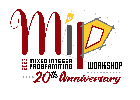

# MIPcc23: The MIP Workshop 2023 Computational Competition

[About](#about) | [Results](#results) | [Challenge Topic](#challenge) | [Call for Benchmarks](#benchmarks) | [Rules](#rules) | [Awards](#awards) | [Important Dates](#timeline) | [Documentation and Support](#doc) | [Organizing Committee](#committee)

## About

The computational development of optimization tools is a key component within the MIP community and has proven to be a challenging task. It requires great knowledge of the well-established methods, technical implementation abilities, as well as creativity to push the boundaries with novel solutions. 
In 2022, the annual [Mixed Integer Programming Workshop](https://www.mixedinteger.org/) established a computational competition in order to encourage and provide recognition to the development of novel practical techniques within MIP technology.
In its first edition, the computational competition focused on finding good-quality primal solutions to general Mixed-Integer Linear Optimization problems.
For the [20th anniversary MIP Workshop 2023](https://www.mixedinteger.org/2023/), the competition will focus on reoptimization of MIPs after slight changes to the input data.

## Results

The **winner** of the competition is [Krunal Patel](https://www.krooonal.com/) with his submission "Progressively Strengthening and Tuning MIP Solvers for
Reoptimization":

*The submission convinced the jury not only through its computational excellence that was displayed by the top ranked performance on almost all public and hidden data sets, but also through its broad applicability and attention to algorithmic details. Building on top of an existing LP-based branch-and-bound solver, the approach distinguishes itself by targeting multiple aspects of the solving process in combination. The reuse of primal information and pseudo costs from previous solving processes is safeguarded by clever methods to re-evaluate and complete this information. By analyzing the success rates of individual solving techniques, the approach learns improved parameter configurations online despite the limited number of observations.*

An **honorable mention** has been awarded to the team of *Paul Strang, Zacharie Ales, Come Bissuel, Olivier Juan, Safia Kedad-Sidhoum, and Emmanuel Rachelson* for their submission "Influence branching for learning to solve mixed integer programs online":

*The jury was intrigued by the successful adaptation of influence branching, an existing graph-based branching strategy for MIP, to the reoptimization setting of the competition. The submission employs online hyperparameter tuning of different influence models via multi-armed bandit selection, a widely recognized online learning framework. Notably, the resulting method consistently performed well on both public and hidden datasets, showcasing its general effectiveness and potential impact.*

**Congratulations from the entire organizing committee!**

## The Challenge Topic: MIP Reoptimization

Traditional MIP benchmarks often focus on the performance to optimize a given instance from scratch.
In many practically relevant settings, however, MIP solvers are used to repeatedly solve a series of similar instances of the same type and only slight modifications of the input data.
Hence, the 2023 competition topic is the development of effective techniques for **reoptimization of mixed integer linear programs** in this setting.

Participants must provide
- a **general solver to optimize a series of related MIPs in sequential order, thereby reusing information from the previous runs in the series**, and
- a **written report** describing their methodology and results.

For each MIP instance in the series, the approach must return a **primal solution** and a valid **dual bound** within a given time limit.
The participants are free to build on any software that is available in source code and that can be used freely for the evaluation of the competition.

The evaluation will be performed on a set of **instance series of 50 related instances** each satisfying:
- The constraints and the number, order, and meaning of variables remain the same across one series of instances,
- but (some or all) of the following input can vary:
  - 1. objective function coefficients,
  - 2. variable bounds,
  - 3. constraint right-hand sides.

For each instance series, the type of change that may occur and the names of varying columns and/or rows as applicable for this type are known. In addition, we have also collected two instance series where part of the coefficients in the constraint matrix varies, since this is also a relevant scenario in practice and valuable for future research on this topic.  This particularly challenging case is not part of the official computational evaluation, but we are curious to learn whether there exist approaches that can be successfully applied also in this case.

Each of the **public instance series** is taken from a specific application in the literature.
In addition, the MIP community is called to submit further benchmarks from which we will select a set of **hidden instance series** for the final evaluation, see below.

The intention of this competition is *not* to perform offline training on different types of applications, but to *reuse information from current and previous solving processes* in order to accelerate the solution of future instances.

Finalists will be provided travel support to present their methods at the [20th anniversary MIP Workshop 2023](https://www.mixedinteger.org/2023/) held May 22-25, 2023, at the University of Southern California.
High-quality submissions will be invited to an expedited review process in [Mathematical Programming Computation](https://www.springer.com/journal/12532).

## Call for Benchmarks

To collect further instance series for future research and for the final evaluation, we call researchers and practitioners of the MIP community to submit additional benchmarks.
One submission should consist of:
- 50 instances in MPS format with the same number, order, and meaning of variables and the same number of constraints.
- A brief description of the model behind the instances, the type of differences between instances, and the source/creation of instance data.
- A statement whether and with what license the instances can be made public after the final evaluation.

A rough guideline for the computational properties that are interesting for the competition: Each single instance should be
- feasible,
- solvable to a gap of 10% or less within 10 minutes using an academic MIP solver,
- solvable to zero gap (or a very small gap of 0.01%) within a few hours using any MIP solver.

*Faster solution times are perfectly acceptable* and not a criterion for exclusion, quite the opposite.
Numerically difficult instances should be avoided.

Deadline for submission of benchmarks is **January 31st, 2023**.  Please submit to mipcc-23@htw-berlin.de and contact us there if you have any questions, since the **instances should remain hidden**.

Participants in the competition may submit benchmarks themselves.  The jury will select hidden instance series carefully in order to ensure that they are suitable and different computational scenarios are represented in a balanced way.  The jury will be free to not use all submissions for the evaluation of the competition.

## Rules and Evaluation Procedure

See the detailed description [here](RULES.md).

## Timeline

- October 2022: Publication of topic and rules
- November 2022: Completion of public instance series
- **January 31st, 2023**: Registration deadline for participation
- January 31st, 2023: Submission deadline for hidden benchmarks
- **~~March 1st~~ Extended: March 15th, 2023**: Submission deadline for report and code (**10pm Pacific Daylight Time**)
- ~~April 5th~~ April 15th, 2023: Notification of results
- May 22nd, 2023: Presentations of the finalists at the MIP Workshop

## Awards

- The jury will select up to three finalists to present their work at the MIP workshop 2023.  The final winner will be announced at the MIP Workshop 2023.
- One representative of each finalist will receive travel support to MIP and free registration.
- The performance of non-finalist submissions will not be published.
- High-quality submissions will receive an expedited review process in [Mathematical Programming Computation](https://www.springer.com/journal/12532).
- The jury may present an award to recognize outstanding student submissions. For these submissions, senior supervisors may be part of the team, but the implementation work must have been fully conducted by students.  Students should not have received their first PhD degree on March 1st, 2023.

## Documentation and Support

This repository contains

- the descriptions [README.md](README.md) and [RULES.md](RULES.md),
- the set of public instance series in the folder [datasets](datasets),
- a few naive baseline implementations in folder [examples](examples) to demonstrate how a submission would look like technically.

We use GitHub's [discussion](https://github.com/ambros-gleixner/MIPcc23/discussions) feature as an open support channel.
Please direct any questions primarily there.
We will not provide privileged support to any of the participants, except in situations where it concerns information about their submission which they do not want to share.
To contact us directly, use the competition's email address: mipcc-23@htw-berlin.de .

## Organizing committee

- [Ambros Gleixner](https://www.zib.de/gleixner/), HTW and Zuse Institute Berlin (Chair)
- [Timo Berthold](https://www.zib.de/berthold/), FICO
- [Mathieu Besançon](https://matbesancon.xyz/), Zuse Institute Berlin
- [Suresh Bolusani](https://coral.ise.lehigh.edu/bsuresh/), Zuse Institute Berlin
- [Claudia D'Ambrosio](https://www.lix.polytechnique.fr/~dambrosio/), CNRS & Ecole Polytechnique (LIX)
- [Gonzalo Muñoz](https://www.gonzalomunoz.org/), Universidad de O'Higgins
- [Joseph Paat](https://sites.google.com/site/josephspaat/), University of British Columbia, Sauder School of Business
- [Dimitri Thomopulos](https://people.unipi.it/dimitri_thomopulos/), Università di Pisa, DESTEC 
